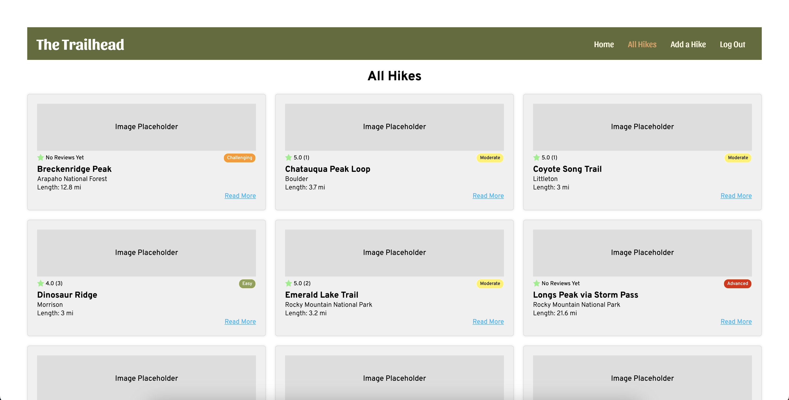
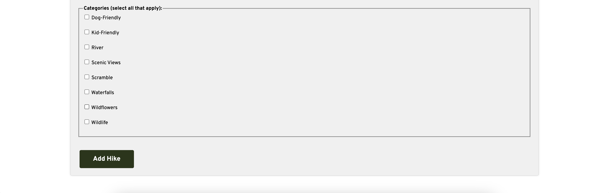

# Hiking Trails App

## Description

The Hiking Trails App is a web application that helps outdoor enthusiasts discover and share their favorite hiking trails. Users can browse a collection of hiking trails, view trail details, leave reviews, and add new trails to the database. Whether you're looking for your first trail or looking for a new place to explore, this app will help you find your next adventure. **Welcome to The Trailhead!**

## Screenshots
#### All Hikes Page

#### Hike Details Page

#### Add a Hike Page

## Technologies Used

- Node.js
- Express.js
- MongoDB
- Mongoose
- EJS (Embedded JavaScript)
- HTML
- CSS
- JavaScript
- Passport.js
- Heroku

## Getting Started 
[Trello Board](https://trello.com/b/0SbNbZs9/sei-hikingappuserstories)  
[Heroku]()

## Next Steps 

- Improve Styling 
- Photo Uploading 
- Sorting on Index Page
- Email Notifications 
- My Profile - with saved hikes and reviews
- Blog Page
- Map Feature
- Admin Privileges 